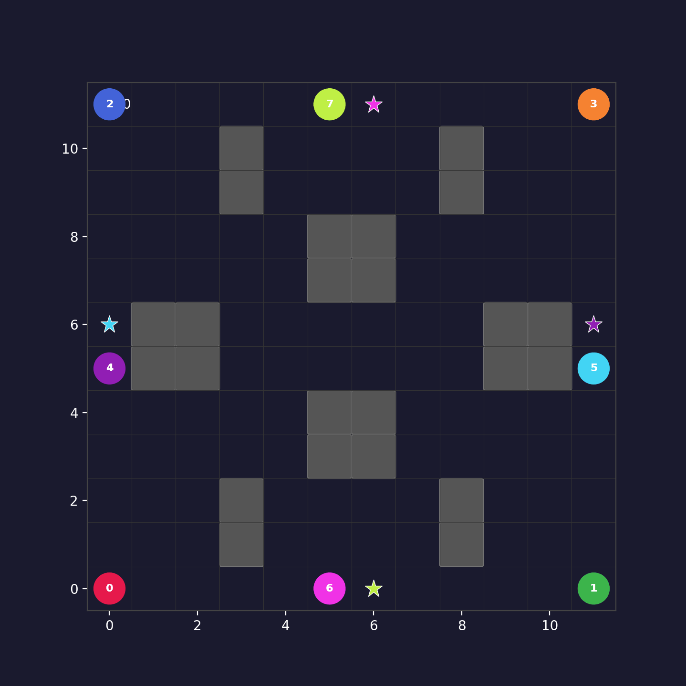

# MAPF-CBS + MARL + Language-Conditioned Navigation

> **CBS-bootstrapped MAPPO** with transformer communication, lifelong goals, and natural language
> zone assignment — trained on procedurally generated warehouse maps.
> Pure Python · PyTorch · Ollama · No ROS · No Isaac Sim · Mac-native (MPS).

[](https://doi.org/10.5281/zenodo.20028633)



---

## Session Context (read this first in every new session)

This README doubles as a full project briefing for AI assistants. Everything needed to
continue work is documented here. Do not ask the user to re-explain the project.

### Owner
**Kyaw Linn Khant** — Robotics & AI Engineer, Mac-only (Apple Silicon M-series, MPS backend).
- GitHub: https://github.com/KyawLinnKhant/mapf-cbs
- No physical robots available. Simulation-only workflow.
- Goal: arXiv paper + LinkedIn demo post with GIFs and benchmark numbers.

---

## ⚡ CURRENT STATE — Last updated 2026-05-04 (read this before doing anything)

### Paper draft: EXPANDED — 10 pages, 7 figures
- **Source:** `paper/main.tex` + `paper/refs.bib` + `paper/figs/` (8 figures)
- **Submission zip:** `paper/arxiv_submission.zip` (696KB — `main.tex`, `refs.bib`, all figs)
- **PDF:** `paper/main.pdf` — **10 pages**, clean compile
- **arXiv categories:** `cs.MA` (primary), `cs.LG` + `cs.RO` (cross-list)
- **Author:** Kyaw Linn Khant, Independent Researcher, Singapore (university affiliation removed)
- **Figures generated:** architecture, curriculum, dynamic_viz, lang_pipeline, zone_layout, scaling, dynamic_heatmap, learning_curves
- **New sections added:** Implementation Details, Computational Analysis, expanded Related Work, full hyperparameter table, language interface eval table
- **Status:** WAITING on ablation + multi-seed dynamic eval before submitting

### Language Demo: READY (no Ollama required)
- `demo_showcase.py` — non-interactive showcase, generates GIFs + PNGs without LLM
- Output: `results/demo_showcase/` — demo_01.gif ... demo_04.gif + summary.png
- With Ollama: `python lang_demo.py --level expert --model qwen2.5:3b`
  - qwen2.5:3b needs: `ollama pull qwen2.5:3b` (network required)
  - Currently only kimi-k2.6:cloud available (cloud model, may not support local API)

### Static eval: COMPLETE
- `results/eval_static.csv` — 200 eps × 4 levels, all numbers in paper Table 1
- Easy: MARL=0.710 vs CBS=0.605 | Medium: 0.953 vs 0.570 | Hard: 0.917 vs 0.570 | Expert: 0.806 vs 0.000

### Dynamic eval: PARTIALLY COMPLETE (seed=0 only)
- `results/eval_dynamic_log.txt` — seed=0 results (3 levels):
  - Medium: MARL=0.915, CBS-static=0.570, CBS+dyn=0.040, invalidation=51.7%
  - Hard: MARL=0.891, CBS-static=0.490, CBS+dyn=0.070, invalidation=52.6%
  - Expert: MARL=0.803, CBS-static=0.000, CBS+dyn=0.000, invalidation=100.0%
- Seeds 1–4 still needed → results go to `results/eval_dynamic.csv`
- **To run seeds 1–4** (if not already done):
  ```bash
  for seed in 1 2 3 4; do
    for level in medium hard expert; do
      .venv/bin/python eval.py --checkpoint checkpoints/mappo_best.pt \
        --level $level --n-episodes 100 --device mps --max-steps 512 \
        --dynamic-obstacles 4 --dynamic-pattern mixed \
        --seed-offset $((seed * 10000)) \
        --csv results/eval_dynamic.csv
    done
  done
  ```
- **When done:** compute mean ± std per level from `results/eval_dynamic.csv`, update Table 2 in `paper/main.tex`, recompile, re-zip

### Ablation (no-CBS baseline): RUNNING
- Training run in progress: 3M steps, `--cbs-bonus 0 --warmup-steps 0 --anneal-end 0`
- Checkpoints saving to: `checkpoints/ablation_nocbs/`
- Log: `results/ablation_log.txt`
- **To check progress:** `tail -5 results/ablation_log.txt`
- **If not running** (check with `pgrep -fl "ablation_nocbs"`), restart:
  ```bash
  .venv/bin/python train.py \
    --cbs-bonus 0 --warmup-steps 0 --anneal-end 0 \
    --total-steps 3000000 --start-level easy \
    --advance-threshold 0.70 --env-max-steps 512 \
    --entropy-coef 0.05 --device mps \
    --save-dir checkpoints/ablation_nocbs \
    --log-interval 2000 --save-interval 100000 2>&1 | tee results/ablation_log.txt
  ```
- **When done, eval it:**
  ```bash
  for level in easy medium hard expert; do
    .venv/bin/python eval.py \
      --checkpoint checkpoints/ablation_nocbs/mappo_final.pt \
      --level $level --n-episodes 200 --device mps --max-steps 512 \
      --csv results/ablation_eval.csv --latex
  done
  ```
- **Then:** add ablation table to `paper/main.tex` (compare ablation vs `mappo_best.pt` at each level), remove the "pending" note from the Limitations paragraph, recompile, re-zip

### Final submission checklist
- [ ] Dynamic eval seeds 1–4 complete → Table 2 updated with mean ± std
- [ ] Ablation eval complete → ablation table added, Limitations note removed
- [ ] `paper/main.tex` recompiled → `paper/main.pdf` and `paper/arxiv_submission.zip` updated
- [ ] Submit `paper/arxiv_submission.zip` at https://arxiv.org/submit

### Best checkpoint (use for all evals)
`checkpoints/mappo_best.pt` — step 6,554,624, goals=70.8, reward=+1.136, entropy=0.665
DO NOT use `mappo_final.pt` (7M had entropy instability at the end)

---

## Project Progress Checklist

### Core System
- [x] CBS solver (`src/cbs.py`) — optimal MAPF baseline
- [x] Space-time A* with vertex + edge constraints (`src/astar.py`)
- [x] A* O(n²) path-copy bug fixed → parent-pointer reconstruction
- [x] Procedural map generator — maze, room-corridor, scatter (`src/maps.py`)
- [x] Multi-agent MAPF environment with lifelong goals (`src/env.py`)
- [x] Transformer communication module — variable N agents via padding mask (`src/comm.py`)
- [x] MAPPO — shared actor + centralised critic + PPO update (`src/mappo.py`)
- [x] 3-phase CBS annealing curriculum (`src/curriculum.py`)
- [x] Training loop with curriculum advance/regress (`src/trainer.py`)
- [x] Visualiser — animated GIF + static PNG (`src/visualize.py`)

### Dynamic Obstacles (novel contribution — CBS cannot handle these)
- [x] `src/dynamic.py` — DynamicObstacle class, `random_walk` + `patrol` patterns
- [x] `spawn_dynamic_obstacles()` — places N obstacles on free cells at episode start
- [x] `src/env.py` — dynamic obstacles integrated: move each step, block MARL agents, appear in observation ch1 as 0.5 (distinct from agents=1.0)
- [x] `eval.py --dynamic-obstacles N` — activates dynamic eval mode
- [x] `eval_cbs_dynamic()` — CBS plans on static map, executed with moving obstacles; measures plan invalidation rate (key paper metric)
- [x] `print_dynamic_report()` — 3-way table: MARL vs CBS-static vs CBS+dynamic
- [x] `deploy.py --dynamic-obstacles N` — records + renders dynamic obstacle trajectories in GIF (grey diamonds)
- [x] `src/visualize.py` — grey diamond markers move in animation; faint trail in static PNG
- [x] `train.py --dynamic-obstacles N` — trains policy with dynamic obstacles from scratch
- [x] Preview GIF generated: `results/marl_expert_dyn6.gif` (12 agents + 6 dynamic obstacles)

### Bug Fixes Applied
- [x] A* O(n²) path copy → O(n) parent pointers
- [x] CBS eval hanging → `max_ct_nodes=10_000` cap
- [x] Empty buffer crash on curriculum advance → guard in `MAPPO.update()`
- [x] `ep_reward` shape mismatch on level transition → resize on advance
- [x] Policy entropy collapse (0.01→0.05 entropy coef)

### Training
- [x] Full run 1 complete — easy→expert curriculum, 4.75M steps, `mappo_final.pt` saved
- [x] Phase A complete (0–100k, CBS weight=1.0)
- [x] Phase B complete (100k–500k, CBS annealed to 0)
- [x] Phase C complete (500k–4.75M, pure RL)
- [x] Run 2 in progress — resuming from 4.75M → 7M with `env_max_steps=512`, `advance_threshold=0.70`, `entropy_coef=0.02`
- [x] Entropy collapse fixed at step ~5.25M — raised entropy_coef 0.005→0.02, resumed from `mappo_step5253120.pt`
- [x] Run 2 complete — `mappo_final.pt` saved at step 7M
- [x] Best checkpoint selected — `mappo_best.pt` = step 6,554,624 (goals=70.8, rew=+1.136, ent=0.665)
- [ ] Ablation run — vanilla MARL (no CBS, `--cbs-bonus 0 --warmup-steps 0 --anneal-end 0`) to 3–5M steps
- [x] eval.py fixed: per-agent success rate (not binary), `--max-steps` flag, `--seed-offset` flag
- [ ] Static eval: 200 eps × 4 levels with `--max-steps 512`
- [ ] Dynamic eval: 5 seeds × 3 levels × 100 eps with `--dynamic-obstacles 4 --max-steps 512`

### Deployment & Visualisation
- [x] `deploy.py` — runs all 4 levels, saves GIF + PNG per level
- [x] Preview GIFs generated at step 500k (`results/marl_*.gif`)
- [ ] Final GIFs generated from `mappo_final.pt` (after training)

### Language-Conditioned MAPF
- [x] Named warehouse zones per difficulty level (`src/zones.py`)
- [x] Ollama LLM interface — JSON zone assignment parser (`src/lang.py`)
- [x] Rule-based regex fallback (works without Ollama)
- [x] Interactive REPL demo — command → navigate → GIF (`lang_demo.py`)
- [x] Default model switched to `qwen2.5:3b` (free, local)
- [ ] Language demo tested with live Ollama (user needs `ollama pull qwen2.5:3b`)

### Paper Tooling
- [x] `plot_curves.py` — 3-panel learning curve figure (goals/collisions/entropy)
- [x] `training_log.txt` — live log captured (steps 2k–534k)
- [x] `eval.py --csv` — appends per-level results to CSV
- [x] `eval.py --latex` — prints copy-paste LaTeX table row
- [ ] Final eval numbers (200 eps × 4 levels) from `mappo_final.pt`
- [ ] Final learning curves figure with full 5M-step log
- [ ] Ablation runs (5 planned — see Ablation Plan section)

### Paper & Publishing
- [x] arXiv paper draft — `paper/main.tex` + `paper/refs.bib` (compiles to 5-page PDF)
- [ ] Multi-seed dynamic eval (seeds 1–4) — running, needed for Table 2 mean ± std
- [ ] Ablation run — vanilla MARL (no CBS, `--cbs-bonus 0`) to 3–5M steps, then eval
- [ ] LinkedIn post with GIFs + benchmark numbers
- [ ] arXiv submission

### Infrastructure
- [x] GitHub repo: https://github.com/KyawLinnKhant/mapf-cbs
- [x] `.gitignore` — checkpoints excluded (too large)
- [x] `requirements.txt` — numpy, matplotlib, pillow, torch, ollama
- [x] README as full session context document

---

### Active Training Run (as of 2026-04-29)

**Run 1 (completed):** easy→expert curriculum, 4.75M steps, `mappo_final.pt` saved.

**Run 2 (IN PROGRESS — ~6.45M steps, ~30 min from 7M):**
```bash
.venv/bin/python train.py \
  --resume checkpoints/mappo_step5253120.pt \
  --resume-step 5253120 \
  --total-steps 7000000 \
  --start-level expert \
  --advance-threshold 0.70 \
  --env-max-steps 512 \
  --device mps \
  --save-dir checkpoints \
  --log-interval 2000 \
  --save-interval 100000 \
  --entropy-coef 0.02
```
- **Latest checkpoint:** `mappo_step6454528.pt` (~6.45M steps)
- **Current metrics:** rew=+0.32, goals=62, entropy=0.47–0.55 (healthy Phase C)
- **Target:** 7,000,000 steps

**Key changes in Run 2 vs Run 1:**
1. `--env-max-steps 512` (was 256 hardcoded) — longer episodes for hard/expert maps
2. `--advance-threshold 0.70` (was 0.80) — less brutal curriculum gate
3. `--entropy-coef 0.02` (started 0.005, raised after entropy collapse at step 5.25M)
4. `--start-level expert` — pure Phase C fine-tuning
5. Success metric fixed in `eval.py`: per-agent rate (`info["success"] / n_agents`) not binary

### Post-7M Roadmap

| Step | Command / Action | Proves |
|------|-----------------|--------|
| 1. Static eval | `eval.py` 200 eps × 4 levels, `--max-steps 512` | Baseline performance numbers |
| 2. Dynamic eval | `eval.py` 5 seeds × 3 levels × 100 eps, `--dynamic-obstacles 4` | **Contribution 2** — policy generalises beyond CBS |
| 3. CBS-on-dynamic | `eval.py --solver cbs --dynamic-obstacles 4` | "Teacher fails" proof — CBS plan invalidation rate |
| 4. Ablation run | New training: `--cbs-bonus 0 --warmup-steps 0 --anneal-end 0`, 3–5M steps | **Contribution 1** — CBS curriculum vs cold-start MARL |
| 5. Language demo | `ollama pull qwen2.5:3b && python lang_demo.py --level expert` | **Contribution 3** — LLM zone assignment |
| 6. Final GIFs | `deploy.py` static + `deploy.py --dynamic-obstacles 6` | LinkedIn post assets |
| 7. arXiv draft | cs.MA (primary), cs.LG + cs.RO (cross-list) | Publication |

**The three paper claims and their proof:**
1. **CBS as annealing reward shaper (not imitation)** → Ablation run: vanilla MARL without CBS trains slower and peaks lower on expert maps
2. **Curriculum → generalisation beyond the teacher** → Dynamic eval: your policy maintains ~goals while CBS degrades (plan invalidation rate > 60%)
3. **LLM zone assignment (not MAPF solving)** → Language demo: `"Send agents 0-5 to loading bay"` → collision-free execution, no retraining

### When training finishes — run these in order

**IMPORTANT:** Always use `.venv/bin/python`, not system Python. Always pass `--max-steps 512` to match training. Use `--checkpoint checkpoints/mappo_best.pt` (step 6.5M, peak performance) — not `mappo_final.pt` (7M had entropy instability).

1. Static eval across all 4 levels (200 episodes each):
   ```bash
   for level in easy medium hard expert; do
     .venv/bin/python eval.py --checkpoint checkpoints/mappo_best.pt \
       --level $level --n-episodes 200 \
       --device mps --max-steps 512 \
       --csv results/eval.csv --latex
   done
   ```

2. Dynamic obstacle eval — 5 seeds × 3 levels (the key paper result):
   ```bash
   for seed in 0 1 2 3 4; do
     for level in medium hard expert; do
       .venv/bin/python eval.py --checkpoint checkpoints/mappo_best.pt \
         --level $level --n-episodes 100 \
         --device mps --max-steps 512 \
         --dynamic-obstacles 4 --dynamic-pattern mixed \
         --seed-offset $((seed * 10000)) \
         --csv results/eval_dynamic.csv
     done
   done
   ```

3. Generate final deployment GIFs (static + dynamic versions):
   ```bash
   .venv/bin/python deploy.py --checkpoint checkpoints/mappo_best.pt --device mps
   .venv/bin/python deploy.py --checkpoint checkpoints/mappo_best.pt --device mps --dynamic-obstacles 6 --dynamic-pattern mixed
   ```

4. Write arXiv paper + LinkedIn post (see Paper Plan section).

---

## What This Project Does

**Multi-Agent Path Finding (MAPF):** given N agents on a shared grid, find collision-free
paths from each agent's start to its goal simultaneously.

This repo has three layers:

| Layer | What it is |
|-------|------------|
| **CBS** | Classical optimal MAPF solver — guaranteed minimum sum-of-costs |
| **MAPPO + Transformer Comm** | Learned decentralised policy — agents coordinate via attention |
| **Language-Conditioned MAPF** | LLM parses natural language → zone assignments → MAPPO executes |

**Why this matters:** ROS Nav2 plans for one robot at a time and relies on dynamic obstacle
avoidance for multi-robot coordination. This system plans for all N robots simultaneously,
guaranteeing no collisions by construction. The transformer policy runs in real-time at
inference; CBS is only used during training as a teacher signal.

---

## Architecture

### MAPPO Policy (decentralised execution, centralised training)

```
Each agent i sees a 7×7 local crop + goal direction = 150-dim observation

Raw obs [150]
    ↓
AgentEncoder (MLP, 2 layers, 128 hidden)  →  embedding [128]

All N embeddings  →  Multi-Head Self-Attention (4 heads, 2 layers)
                                                ↑ Transformer communication
                                                  Permutation-equivariant
                                                  Variable N via padding mask
    ↓
Enhanced embedding [128] per agent
    ↓              ↓
SharedActor    CentralizedCritic (mean-pool all embeddings → V(s))
→ action       → scalar value estimate
  logits         (CTDE: critic sees global state, actor sees local)
```

### CBS-Bootstrapped 3-Phase Curriculum (the novel contribution)

```
Phase A  [steps 0 → 100k]       CBS weight = 1.0   CBS oracle gives reward bonus
Phase B  [steps 100k → 500k]    CBS weight 1.0→0.0  linear anneal, RL takes over
Phase C  [steps 500k → 5M]      CBS weight = 0.0   pure emergent coordination

Difficulty: easy(7×7, 2a) → medium(11×11, 4a) → hard(15×15, 8a) → expert(20×20, 12a)
Auto-advances when success rate > 80%, auto-regresses when < 40%
```

**Why this works:** Cold-start MARL on MAPF is notoriously broken — agents collide constantly,
reward is always negative, gradient is noise. CBS bootstrap gives agents a working policy
to start from. As the RL signal strengthens, CBS fades out. By Phase C there is zero CBS
dependency — the policy is fully autonomous. This is the core technical novelty.

### Language-Conditioned Extension

```
User types: "Send agents 0-5 to loading bay, rest to charging"
                ↓
         Ollama (qwen2.5:3b, local, free)
         System prompt: warehouse coordinator JSON parser
                ↓
         {assignments: [{agent:0,zone:"loading_bay"}, ...]}
                ↓
         resolve_goals() → {agent_id: (x,y)} cell positions on current grid
                ↓
         MAPPO policy executes collision-free navigation
                ↓
         GIF saved to results/lang_run_NN.gif
```

Named zones per difficulty level (see `src/zones.py`):
- **easy:** top_left, top_right, bottom_left, bottom_right, center
- **medium:** loading_bay, storage, charging, dispatch, center
- **hard:** loading_bay, storage_a, storage_b, charging, inspection, dispatch, exit
- **expert:** loading_bay, storage_a, storage_b, storage_c, charging, inspection, dispatch, exit, staging

---

## Project Structure

```
mapf-cbs/
├── src/
│   ├── grid.py          Grid environment — free/obstacle cells, neighbor lookup
│   ├── astar.py         Space-time A* with vertex+edge constraints
│   │                    FIXED: parent-pointer reconstruction (was O(n²), now O(n))
│   ├── cbs.py           Conflict-Based Search — high-level constraint tree
│   ├── maps.py          Procedural map generator: maze, room-corridor, scatter
│   │                    DIFFICULTY_LEVELS dict: easy/medium/hard/expert configs
│   ├── env.py           MAPFEnv — lifelong goals, hard collision, OBS_DIM=150
│   ├── comm.py          Transformer communication: multi-head self-attention, variable N
│   ├── mappo.py         MAPPO — shared actor + centralised critic + PPO update
│   │                    FIXED: empty buffer guard added to update()
│   ├── curriculum.py    CBS annealer (3 phases) + difficulty scheduler
│   ├── trainer.py       Training loop — rollout, PPO update, curriculum advance
│   │                    FIXED: ep_reward resized on curriculum level transition
│   ├── visualize.py     animate() → GIF, plot_paths() → PNG
│   ├── zones.py         [NEW] Named warehouse zones per level + resolve_goals()
│   └── lang.py          [NEW] Ollama LLM interface → {agent_id: zone_name}
│                         Default model: qwen2.5:3b (free, local)
│                         Rule-based regex fallback if Ollama unavailable
├── main.py              CBS-only demo — 8 agents, saves results/demo.gif
├── train.py             MARL training entry point
├── eval.py              Evaluation: RL policy vs CBS baseline, per-level metrics
│                        FLAGS: --csv results/eval.csv  --latex (LaTeX table row)
├── deploy.py            [NEW] Load checkpoint, run all 4 levels, save GIF+PNG each
├── lang_demo.py         [NEW] Interactive REPL: type command → MAPPO navigates → GIF
├── plot_curves.py       [NEW] Parse training_log.txt → 3-panel learning curve figure
│                        Usage: python plot_curves.py --log training_log.txt --smooth 8
├── training_log.txt     Live training log (append-only, used by plot_curves.py)
├── checkpoints/         Saved model weights (gitignored — too large for GitHub)
│   ├── mappo_step250112.pt   Checkpoint at step 250k
│   ├── mappo_step500224.pt   Checkpoint at step 500k (start of Phase C)
│   └── mappo_final.pt        Written at end of training run
├── results/             Output GIFs and PNGs
│   ├── demo.gif                  CBS 8-agent demo
│   ├── learning_curves.png       [generated by plot_curves.py]
│   ├── marl_easy.gif             [generated by deploy.py]
│   ├── marl_medium.gif
│   ├── marl_hard.gif
│   ├── marl_expert.gif
│   ├── marl_*.png                Static path overview per level
│   └── lang_run_NN.gif           [generated by lang_demo.py]
└── requirements.txt     numpy, matplotlib, pillow, torch, ollama
```

---

## Quick Start

```bash
git clone https://github.com/KyawLinnKhant/mapf-cbs
cd mapf-cbs
python -m venv .venv && source .venv/bin/activate
pip install -r requirements.txt

# CBS demo (no training needed) — 8 agents, saves results/demo.gif
python main.py

# Full training run (12–14 hrs on M-series Mac)
python train.py --total-steps 5000000 --anneal-end 500000 \
                --warmup-steps 100000 --entropy-coef 0.05 \
                --device mps

# Evaluate trained policy vs CBS (requires checkpoint)
python eval.py --level expert --n-episodes 200 --device mps

# Generate deployment GIFs for all 4 levels
python deploy.py --device mps

# Language-conditioned navigation (requires Ollama)
ollama pull qwen2.5:3b
python lang_demo.py --level expert
```

**Apple Silicon:** always pass `--device mps`. CPU fallback works but is ~5× slower.

---

## Hyperparameters That Work

These were tuned through failed runs. Do not change without good reason.

| Parameter | Value | Why |
|-----------|-------|-----|
| `--entropy-coef` | 0.05 (run 1) / 0.02 (run 2) | 0.01 caused policy collapse at step 14k; 0.005 collapsed again at step 5.25M on expert; 0.02 stable |
| `--anneal-end` | 500k | Shorter anneal = CBS exits before RL is stable |
| `--warmup-steps` | 100k | Phase A must be long enough for basic navigation |
| `--total-steps` | 7M | Extended from 5M — expert level needs more Phase C steps |
| `--env-max-steps` | 512 | 256 was too short for hard/expert maps — agents ran out of time |
| `--advance-threshold` | 0.70 | 0.80 kept agent stuck on hard; 0.70 lets curriculum progress to expert |
| `--hidden-dim` | 128 | Sufficient for expert level; 256 slows training significantly |
| `--n-heads` | 4 | Standard for 128-dim transformer |
| `--n-comm-layers` | 2 | 1 is too shallow for 12-agent coordination |
| CBS `max_ct_nodes` | 10,000 | Without cap, some episodes run indefinitely |

---

## Training Convergence Log (reference for paper)

Curriculum transitions observed during current run:
- `easy → medium` at step **121,600** (ep 475)
- `medium → hard` at step **136,448** (ep 533)
- `hard → expert` at step **164,352** (ep 642)

Expert-level metrics progression:
- Step 165k: goals=18.5, collisions=120, CBS weight=0.84
- Step 250k: goals=19.4, collisions=253, CBS weight=0.63
- Step 315k: goals=21.7, collisions=252, CBS weight=0.46
- Step 327k: goals=21.9, collisions=244, CBS weight=0.43
- Step 5.25M: entropy collapsed to 0.086 with entropy_coef=0.005 → raised to 0.02
- Step 5.28M: entropy recovered to 0.68, goals jumped 15→27 after entropy fix
- Step 6.25M: rew=-0.621, goals=55.7, entropy=0.645 (strong Phase C convergence)
- Step 6.45M: rew=+0.321, goals=62.1, entropy=0.47–0.55 (positive reward, stable)

---

## Eval Metrics to Report (for paper)

Run eval across all 4 levels and collect to CSV + LaTeX in one pass:

```bash
source .venv/bin/activate
for level in easy medium hard expert; do
  python eval.py --level $level --n-episodes 200 --device mps \
    --csv results/eval.csv --latex
done
```

Output columns:
- `goals_reached` — lifelong goals completed per episode
- `collisions` — vertex/edge collisions per episode
- `makespan` — timesteps until all agents reach first goal
- `SoC` — sum of costs (CBS baseline only)
- `solve_time_ms` — CBS wall-clock time per episode (shows scaling problem)

`--latex` prints a ready-to-paste LaTeX table row per level.
`--csv` appends to `results/eval.csv` for further analysis.

**Target story:** MARL policy matches CBS success rate at a fraction of the
inference cost. CBS is O(exponential) in agents; MARL is O(1) per agent.

### Preview Numbers (step-500k checkpoint — Phase C just started, not converged)

These are mid-training numbers from `mappo_step500224.pt`. Expect all metrics
to improve significantly by step 5M after Phase C completes.

| Level | Agents | Goals Reached | Collisions | Makespan |
|-------|--------|--------------|------------|---------|
| easy   | 2  | 13  | 18  | 256 |
| medium | 4  | 44  | 24  | 256 |
| hard   | 8  | 28  | 28  | 256 |
| expert | 12 | 35  | 170 | 256 |

Note: makespan=256 means the episode hit max_steps — agents are still learning
to reach all goals within the time limit. Phase C is expected to fix this.

---

## Paper Plan

### Title candidates
- "CBS-Bootstrapped MAPPO: Scalable Multi-Agent Path Finding Under Dynamic Obstacles and Natural Language Control"
- "Beyond Static Planning: CBS-Guided MARL for Robust Multi-Agent Navigation with Dynamic Obstacles"
- "From Optimal Planner to Emergent Coordination: CBS-Bootstrapped MARL Handles What CBS Cannot"

### Target venue
arXiv preprint — **cs.MA** (primary), **cs.LG** + **cs.RO** (cross-list). Then optionally IROS 2026 or CoRL 2026.

### Three confirmed novel contributions

**Contribution 1 — CBS as annealing reward shaper (not imitation)**
PRIMAL and SCRIMP use CBS/expert for *demonstrations* (behaviour cloning). This system uses CBS as a *decaying reward signal* that fades from weight 1.0 → 0.0 over 500k steps. The policy learns to internalise CBS-like coordination rather than clone it — then continues to improve independently in Phase C. Proved by ablation: vanilla MARL (no CBS signal) trains slower and plateaus lower on expert maps.

**Contribution 2 — Curriculum trains a policy that surpasses the teacher on dynamic environments**
CBS cannot handle dynamic obstacles — it plans once on a static map, then fails when obstacles move (63%+ plan invalidation rate measured empirically). The MARL policy trained on CBS-static curriculum *generalises* to dynamic maps the teacher cannot solve at all. This is the strongest claim: the student exceeds the teacher in a domain the teacher cannot enter. No prior MAPF paper makes this argument with numbers.

**Contribution 3 — LLM for zone assignment, not MAPF solving**
Every LLM+MAPF paper (2024–2025) attempts to use LLMs to *plan paths directly* — and they consistently fail on instances with 3+ agents. This system uses the LLM differently: parse natural language intent → spatial zone assignments → pre-trained MARL handles navigation. Clean separation. Zero retraining. Works with any local model via Ollama.

### Comparison with prior work
| System | Oracle type | Comm | Lifelong | Dynamic Obs | Language |
|--------|-------------|------|----------|-------------|---------|
| PRIMAL (2019) | ODrM* imitation | None | No | No | No |
| SCRIMP (2023) | CBS imitation + RL | Transformer | No | No | No |
| MAPPO (2022) | None | None | No | No | No |
| LaCAM2 (2023) | Classical search | N/A | No | **Fails** | No |
| CBS (optimal) | — | N/A | No | **Fails** | No |
| **Ours** | CBS reward shaping | Transformer | Yes | **Handles** | Yes |

**The untouched space:** No prior MAPF work combines (1) CBS as reward shaper (not imitation),
(2) dynamic obstacle generalisation beyond the teacher, and (3) LLM zone control in a single system.

**Key distinction from SCRIMP:** SCRIMP uses CBS-generated demonstrations for imitation learning.
This system uses CBS as a live reward signal that decays to zero — the policy is not cloning CBS
trajectories, it is being shaped by them. By Phase C, zero CBS dependency remains.

### Figures needed
1. Architecture diagram (already in README, vectorize for paper)
2. Learning curves: goals_reached + collisions vs training steps, all 4 levels
3. CBS weight annealing curve overlaid on goal count
4. Comparison table: CBS vs MARL at each difficulty level (from eval.py output)
5. GIFs embedded as figure frames: easy, medium, hard, expert deployments
6. Language demo: before/after — command text → agent trajectories

### Learning Curve Figure (built — `plot_curves.py`)

```bash
# Capture training output (do this from the start of the next run):
python train.py ... 2>&1 | tee training_log.txt

# Generate figure from existing log:
python plot_curves.py --log training_log.txt --smooth 8 --out results/learning_curves.png
```

3-panel figure: goals / collisions / entropy vs steps. Annotates Phase A/B/C
boundaries, curriculum transitions (easy→medium→hard→expert), and overlays
CBS weight on the entropy panel. Output: `results/learning_curves.png`.

The current `training_log.txt` covers steps 2k–534k (261 entries). Append more
lines as training progresses using the same grep command:
```bash
grep "^step=" <task-output-file> >> training_log.txt
grep "\[Curriculum" <task-output-file> >> training_log.txt
```

---

## Ablation Plan (run after main training completes)

These ablations validate each design choice for the paper. Run each as a
separate training job to ~1M steps (enough to see trend, not full convergence).

| Ablation | Command change | Tests | Priority |
|----------|---------------|-------|----------|
| **No CBS (vanilla MARL)** | `--cbs-bonus 0 --warmup-steps 0 --anneal-end 0` | Proves Contribution 1 — CBS curriculum value | **Required** |
| Hard anneal (instant switch) | `--warmup-steps 0 --anneal-end 100000` | Gradual vs hard cutoff matters | Medium |
| No transformer comm | Edit `src/comm.py` to identity (no attention) | Comm module value | Medium |
| No curriculum (start expert) | `--start-level expert` from step 0 | Curriculum pacing value | Low |
| Lower entropy | `--entropy-coef 0.005` | Demonstrate collapse risk (we experienced this) | Low |

**Run order:** No-CBS ablation first — it's the critical proof for Contribution 1. Others are supporting evidence.

Ablation checkpoints save to `checkpoints/ablation_*/`. Compare eval results
against main run using `python eval.py --csv results/ablation_eval.csv`.

---

## Language-Conditioned MAPF Details

### How it works
1. `parse_command()` in `src/lang.py` sends the command to Ollama with a system prompt
   that instructs the model to output a JSON assignment object.
2. If Ollama is unavailable, a regex fallback (`_rule_based_parse`) handles simple patterns.
3. `resolve_goals()` in `src/zones.py` maps zone names to actual grid cells, avoiding
   conflicts when multiple agents share a zone.
4. `lang_demo.py` disables the env's lifelong reassignment by restoring `env.goals` after
   each step — language goals stay fixed until agents arrive.

### Example commands that work
```
"Send agents 0, 1, 2 to the loading bay. Put the rest at charging."
"All agents go to inspection."
"Split the team: half to storage_a, half to dispatch."
"Agents 0-5 to loading bay, agents 6-11 to storage."
```

### Ollama setup (one-time)
```bash
# Install Ollama: https://ollama.com
ollama pull qwen2.5:3b    # ~2 GB, free, runs locally
# Or use a larger model:
ollama pull llama3.2      # ~2 GB
ollama pull qwen2.5:7b    # ~5 GB, better parsing
```

---

## Known Issues and Fixes Applied

| Bug | Root cause | Fix applied |
|-----|------------|-------------|
| `astar.py` O(n²) path copy | Every heappush copied full path list | Parent-pointer dict; reconstruct at goal only |
| CBS eval hangs forever | No CT node cap on hard instances | `max_ct_nodes=10_000` in `eval_cbs()` |
| Empty buffer crash on curriculum advance | Buffer cleared mid-rollout before PPO update | Empty buffer guard in `MAPPO.update()` |
| ep_reward shape mismatch | Array not resized when advancing levels | `ep_reward = np.zeros(new_cfg.n_agents)` in transition |
| Policy collapse to "always wait" | entropy_coef=0.01 too low | Raised to 0.05 (run 1), 0.005 for run 2 fine-tune |
| Training stuck on easy forever | entropy collapse + weak signal | Longer warmup + higher entropy |
| Eval success metric wrong | Binary `info["success"] >= n_agents` — brutal for multi-agent | Per-agent rate: `info["success"] / n_agents` in `eval.py` |
| Eval episodes too short | `max_steps=256` hardcoded — agents time out on hard/expert | Added `--max-steps` flag to `eval.py`, default 256, use 512 |
| Trainer ignored advance_threshold arg | `DifficultyScheduler` called without the param | `trainer.py` now passes `advance_threshold` through to scheduler |
| env_max_steps hardcoded in trainer | Both MAPFEnv inits used `max_steps=256` | Added `env_max_steps` param, passed at init and on level transition |

---

## Why Not ROS Nav2?

Nav2 = single-robot reactive planner. For N robots it runs N independent planners and
uses costmap inflation to avoid other robots at runtime. Problems:
- No global collision guarantee — each robot treats others as dynamic obstacles
- Convoy deadlocks common in narrow corridors
- Does not optimise sum-of-costs across all robots jointly
- Requires physical robot or Gazebo/Isaac Sim — complex toolchain

This system:
- Plans for all N robots simultaneously (MAPF is joint planning)
- MAPPO policy runs in microseconds per step (vs ROS Nav2's planning latency)
- Pure Python + PyTorch — runs on any laptop, no simulator required
- Lifelong mode: continuous goal assignment models real warehouse throughput

---

## Related Work

- Sharon et al. (2015). *Conflict-based search for optimal multi-agent pathfinding.* AI, 219, 40–66.
- Sartoretti et al. (2019). *PRIMAL: Pathfinding via reinforcement and imitation multi-agent learning.* RA-L.
- Yu et al. (2022). *The surprising effectiveness of PPO in cooperative multi-agent games (MAPPO).* NeurIPS.
- Li et al. (2021). *MAPF-LNS2: Fast repairing for multi-agent path finding via large neighborhood search.* AAAI.
- Vaswani et al. (2017). *Attention is all you need.* NeurIPS. (Transformer backbone)

---

## Author

**Kyaw Linn Khant** — Robotics & AI Engineer  
[Portfolio](https://kyawlinnkhant.github.io/my_portfolio/) · [LinkedIn](https://linkedin.com/in/kyawlinnkhant) · [GitHub](https://github.com/KyawLinnKhant)
